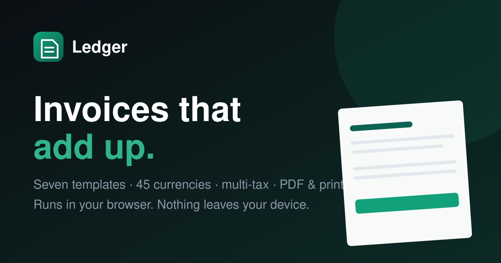

# Ledger — Invoice Generator

A single-page invoice generator that runs entirely in the browser. Fill in the form on
the left, watch the paper on the right update as you type, then print it or export a PDF.
There is no backend: invoices, logos and history live in `localStorage` on the device
that created them.



---

## Quick start

```bash
npm install
npm run dev      # http://localhost:5173
```

Production build and local preview:

```bash
npm run build
npm run preview
```

`npm run build` type-checks with `tsc -b` first, then bundles with Vite. The output in
`dist/` is fully static — drop it on Netlify, Vercel, GitHub Pages, S3, Cloudflare Pages
or any web server. No environment variables, no server-side rendering, no API keys.

Other scripts:

| Script              | What it does                          |
| ------------------- | ------------------------------------- |
| `npm run dev`       | Vite dev server with fast refresh     |
| `npm run build`     | Type-check, then production bundle    |
| `npm run preview`   | Serve `dist/` locally                 |
| `npm run typecheck` | Types only, no emit                   |
| `npm run lint`      | ESLint over `src/`                    |

**Requirements:** Node 18 or newer.

---

## What it does

**The invoice**

- Business details: name, logo, address, phone, email, website, tax number, registration number
- Customer details: name, company, billing address, separate shipping address, phone, email, tax ID
- Auto-numbered invoices (`INV-2026-0001` → `INV-2026-0002`), issue and due dates, PO number,
  payment terms, status, notes and terms & conditions
- Unlimited line items with name, description, quantity, unit price, per-line tax rate,
  per-line discount and a live line total. Rows can be added, deleted, duplicated and
  reordered — by dragging, or with the keyboard.

**Money**

- 45 currencies with correct symbols, locale grouping and minor units (JPY has no decimals,
  KWD has three)
- Multiple stacking taxes: percentage or fixed, VAT / GST / sales tax presets, and compound
  rules that charge tax on the taxes above them
- Discounts at both levels — per line and per invoice, flat or percentage
- Shipping plus any number of ad-hoc charges
- Every figure comes from one pure function, [`src/lib/calc.ts`](src/lib/calc.ts), so the
  editor, the preview and the PDF can never disagree

**Output**

- Seven templates — Modern, Minimal, Corporate, Elegant, Classic, Professional, Creative —
  each with an adjustable accent colour, switchable instantly
- Live A4 preview that reflows as you type, with zoom and fit-to-width
- PDF export at print resolution, split across pages for long invoices
- One-click print that produces the same document, exactly
- PNG export from the overflow menu

**Working with it**

- Autosaves the draft as you type; reopens exactly where you left off
- Local history with search, status filters, duplicate and delete
- ⌘K opens a palette that searches saved invoices, the customers and products derived from
  them, and every command
- Light and dark themes, remembered between visits, following the OS until you choose
- Toasts for every save, delete, export and failure

---

## Keyboard shortcuts

| Shortcut | Action                    |
| -------- | ------------------------- |
| `⌘K`     | Search and commands       |
| `⌘S`     | Save the invoice          |
| `⌘D`     | Download as PDF           |
| `⌘P`     | Print                     |
| `⇧⌘N`    | Start a new invoice       |
| `⇧⌘H`    | Toggle saved invoices     |

Use `Ctrl` in place of `⌘` outside macOS.

---

## Project structure

```
src/
├── components/
│   ├── ui/            Button, Field, Modal, Menu, Switch, Panel, Tooltip, Toast, Skeleton…
│   ├── layout/        Navbar, Workspace, CommandPalette, PreviewColumn, ThemeToggle
│   ├── invoice/       The six editor sections, item rows, logo uploader + cropper, totals
│   ├── preview/       The scaled A4 sheet, template rail
│   │   └── templates/ The seven templates and their shared primitives
│   └── history/       Saved-invoice drawer
├── context/           Theme, toasts, and the invoice archive
├── hooks/             Media queries, hotkeys, debounce, click-outside, history
├── lib/               calc · format · schema · storage · pdf · sanitize · invoice-factory
├── constants/         Currencies, templates, statuses, payment terms, tax presets
└── types/             The Invoice domain model
```

### How it fits together

- **One source of truth for values.** A single `useForm<Invoice>` holds the whole invoice.
  The preview subscribes with `useWatch` in its own component, so a keystroke re-renders the
  sheet without touching the navbar or the other sections.
- **One source of truth for numbers.** `calculateTotals` is pure and synchronous. Nothing
  else adds anything up.
- **The sheet is a document, not a UI panel.** Templates use literal hex colours and no CSS
  grid, so they render identically in light mode, dark mode, print and PDF — and so
  html2canvas rasterises them faithfully.
- **The preview, the printout and the PDF are the same DOM.** The sheet always lays out at
  794 px (A4 at 96 dpi) and is scaled with a transform for display. There is no separate
  print layout to keep in sync.
- **Everything untrusted is normalised on the way in.** `normalizeInvoice` coerces any blob
  from `localStorage` into a valid `Invoice`, and no exception escapes it.

---

## Data, privacy and security

Nothing is uploaded. Everything lives under the `ledger.` prefix in `localStorage`:

| Key                 | Contents                              |
| ------------------- | ------------------------------------- |
| `ledger.draft`      | The invoice currently being edited    |
| `ledger.history`    | Saved invoices, newest first          |
| `ledger.theme`      | Light or dark                         |
| `ledger.lastNumber` | The last number used, for the series  |
| `ledger.version`    | Schema version, for future migrations |

- Free text is stripped of control characters and length-capped before storage
- URLs are parsed and allow-listed to `http`, `https`, `mailto` and `tel`, so a
  `javascript:` value can never reach an `href`
- Uploaded logos are re-encoded to PNG through a canvas, which strips any script an SVG
  might have carried; only raster data URLs are ever stored. Transparency is preserved,
  and the cropper measures the artwork's luminance so templates with a coloured header
  know whether the logo needs a white plate behind it
- Accent colours must match `#rgb` or `#rrggbb`
- History is capped at 100 invoices and trims oldest-first if the browser refuses a write,
  so autosave cannot fail on a full quota

Clearing site data erases everything. Save a PDF of anything you need to keep.

---

## Accessibility

- Full keyboard operation, including reordering line items and panning the logo cropper
- Focus is trapped in dialogs and returned to the trigger on close
- Labelled form controls, `aria-invalid` and `role="alert"` on validation messages
- Live regions for toasts and autosave state
- One visible focus ring across the whole app
- `prefers-reduced-motion` is respected; the page's entrance is a CSS animation, so content
  is never left invisible if rAF is throttled

---

## Performance

- Each template is a separate chunk, loaded on demand and prefetched on hover
- `jspdf` and `html2canvas` — the largest dependencies by far — are imported dynamically the
  first time you export, so a visitor who never exports never downloads them
- Vendor chunks are split so React, forms, motion and export libraries cache independently
- The preview's full-form subscription is isolated in one component
- Fonts load with `display=swap` behind `preconnect`

---

## Browser support

Current Chrome, Edge, Firefox and Safari, on desktop and mobile. PDF export needs canvas
and blob downloads; if it ever fails, the toast points at Print, which produces the same
page through the browser's own engine.

---

## Built with

React 18 · TypeScript · Vite 5 · Tailwind CSS 3 · React Hook Form + Zod · Framer Motion ·
Lucide · html2canvas · jsPDF

Type: Plus Jakarta Sans (interface), JetBrains Mono (figures and identifiers),
Playfair Display (the serif templates).
